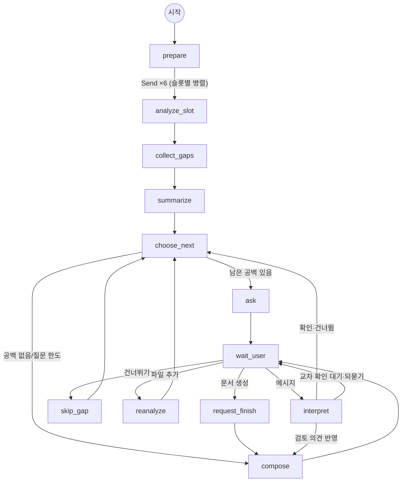

# AMIGO AI — 인수인계 인터뷰 에이전트 (LangGraph)

AI 기반 인수인계서 자동 작성 시스템의 **AI 에이전트 계층**입니다.
업무 자료를 분석해 인수인계서 항목(슬롯)을 채우고, 비어 있는 부분을 **한 번에 하나씩** 질문하며,
답변을 교차 확인한 뒤 근거가 표시된 인수인계서를 작성합니다.

```
FrontEnd ──HTTP──▶ BackEnd(FastAPI) ──▶ AI(이 저장소: HandoverAgent) ──search_documents()──▶ RAG(ChromaDB)
```

## 상태 머신 (STAGE 1 → 4)



| 단계 | 노드 | 하는 일 |
|---|---|---|
| STAGE 1 분석 | `prepare` → `analyze_slot` ×6 → `collect_gaps` | 슬롯(장)별로 근거를 검색하고, 모자라면 모델이 `search_documents` 를 스스로 호출해 연결 정보를 추가 탐색(Agentic RAG). 항목·충족 수준·공백(gap) 도출 |
| STAGE 2 요약 | `summarize` | 장별 충족 현황(🟢충분/🟡부분/🔴부족)과 안내문 |
| STAGE 3 Q&A | `choose_next` → `ask` → `wait_user`(interrupt) → `interpret` | 공백을 우선순위대로 **하나씩** 질문 → 답변 해석·항목 갱신 → **교차 확인**("이렇게 정리했는데 맞나요?") → 다음 질문. 건너뛰기·되묻기·정정 처리, 대화 중 파일 추가 시 재분석 |
| STAGE 4 생성 | `compose` | 업무 개요·핵심 당부사항(LLM) + 표·근거 번호(코드)로 Markdown 인수인계서 작성. 이후 검토 의견을 받아 버전업 |

`wait_user` 노드가 LangGraph `interrupt()` 로 사람 입력을 기다리고, 체크포인터(SQLite)에 상태가 저장되므로
서버를 재시작해도 대화를 이어 갈 수 있습니다. `python -m amigo_agent graph` 로 실제 그래프를 Mermaid 로 출력합니다.

## 인수인계서 양식(슬롯)

`template.py` 에 정의되어 있으며 사내 양식이 바뀌면 이 파일만 수정합니다.

| 슬롯 | 필드 (굵게 = 필수) |
|---|---|
| 담당 업무 | **업무명**, **주요 내용**, 비중, 산출물 (최소 2건) |
| 반복 수행 업무 | **업무**, **주기**, **시기·기한**, 처리 절차, 관련 부서·시스템 |
| 진행 중인 과제 | **과제명**, **현황**, 일정, **다음 할 일**, 관련자 |
| 협업 관계 | **부서·업체**, **담당자**, **협업 내용**, **연락처** |
| 사용 시스템 및 접근 권한 | **시스템**, **용도**, 권한 수준, **신청·이관 방법** |
| 주요 이슈 및 유의사항 | **이슈**, 현황, **대응 방안**, 기한 |

충족 수준은 "규칙(필수 필드·최소 항목 수)"과 "LLM 판정" 중 **더 보수적인 쪽**을 택해, 근거 없이 '충분'으로 넘어가지 않게 했습니다.

## 백엔드에서 사용하기

```python
from amigo_agent import HandoverAgent
from amigo_rag import KnowledgeBase

agent = HandoverAgent.with_sqlite("data/agent_checkpoints.sqlite")
kb = KnowledgeBase(session_id)

def on_event(event: dict):          # 진행 중 이벤트를 받아 DB 에 저장 → 프론트가 폴링
    ...                             # stage / progress / slot / message / document

agent.start(session_id, profile, kb, on_event=on_event)         # STAGE 1 → 2 → 첫 질문
agent.send_message(session_id, "업체 담당자는 …", kb, on_event)    # 답변 처리
agent.skip(session_id, kb, on_event)                             # 건너뛰기
agent.notify_files(session_id, kb, ["계약서.pdf"], on_event)      # 대화 중 자료 추가 → 재분석
agent.finish(session_id, kb, on_event)                           # 지금 문서 생성
agent.retry(session_id, kb, on_event)                            # 오류로 멈춘 실행 재시도
agent.snapshot(session_id)  # {"stage","waiting","slots","gaps","pending","document","document_version",...}
```

`kb` 는 `search(query, top_k)` 만 있으면 되는 덕 타이핑 인터페이스입니다(`add_text`, `list_sources` 는 선택).
그래서 RAG 없이 가짜 지식베이스로도 개발·테스트할 수 있습니다(`tests/conftest.py::FakeKB`).

## LLM 설정 (Claude)

- 공식 Anthropic Python SDK 로 `claude-opus-5-5` 를 호출합니다(`AMIGO_LLM_MODEL` 로 변경).
- **구조화 출력**(`output_config.format` JSON 스키마)으로 결과를 받아 Pydantic 으로 검증합니다.
- **도구 호출**: `search_documents`(strict 스키마)를 모델이 필요할 때 호출하고, 결과를 `[E번호]` 근거로 돌려줍니다.
  항목은 근거 번호가 있어야만 기록되며(환각 방지), 번호는 최종 문서의 각주로 이어집니다.
- Opus 5.5 는 thinking 을 끌 수 없으므로 `effort` 로 조절합니다: 분석 `medium`, 대화 `low`, 문서 `medium`.
- **안전 분류기 거절 대비**: 서버 측 fallbacks(`server-side-fallback-2026-07-01`, `fallbacks="default"`)를 기본으로 켭니다.
  끄려면 `AMIGO_LLM_FALLBACKS=false`. 거절이 끝까지 이어지면 사용자에게 안내 메시지를 보여 줍니다.
- 시스템 프롬프트는 고정해 프롬프트 캐시를 활용합니다.

**API 키가 없으면** 규칙 기반 오프라인 엔진(`engine/offline.py`)으로 자동 전환되어 전체 흐름을 그대로 시연할 수 있습니다.
(표 머리글 매핑·정규식 추출이라 품질은 낮지만 결정적으로 동작합니다.)

| 환경변수 | 기본값 | 설명 |
|---|---|---|
| `ANTHROPIC_API_KEY` | | Claude API 키(또는 `ant auth login` 프로필) |
| `AMIGO_LLM_MODE` | `auto` | `auto` / `claude` / `offline` |
| `AMIGO_LLM_MODEL` | `claude-opus-5-5` | 사용할 모델 |
| `AMIGO_EFFORT_ANALYSIS` / `_CHAT` / `_COMPOSE` | `medium` / `low` / `medium` | 단계별 effort |
| `AMIGO_LLM_FALLBACKS` | `true` | 서버 측 거절 fallback |
| `AMIGO_MAX_QUESTIONS` | `12` | 최대 질문 수 |
| `AMIGO_MAX_GAPS_PER_SLOT` | `2` | 슬롯당 질문 후보 수 |
| `AMIGO_MAX_CONCURRENCY` | `3` | 슬롯 병렬 분석 수(최소 2) |
| `AMIGO_SEARCH_TOP_K`, `AMIGO_MAX_TOOL_ROUNDS` | `6`, `3` | 검색 결과 수, 도구 호출 횟수 |

## 개발

```bash
pip install -e ../RAG        # 같은 폴더에 RAG 저장소를 받아 둔 경우
pip install -e ".[dev]"
pytest -q                    # 오프라인 흐름 + 가짜 Anthropic 클라이언트로 Claude 경로 검증
python -m amigo_agent chat --files ../RAG/samples/*.pdf ../RAG/samples/*.docx ../RAG/samples/*.eml
```

주요 파일: `template.py`(양식) · `graph.py`(상태 머신) · `nodes.py`(노드) · `engine/claude.py`(LLM) ·
`engine/offline.py`(규칙 기반) · `prompts.py`(프롬프트) · `render.py`(문서) · `agent.py`(진입점)
